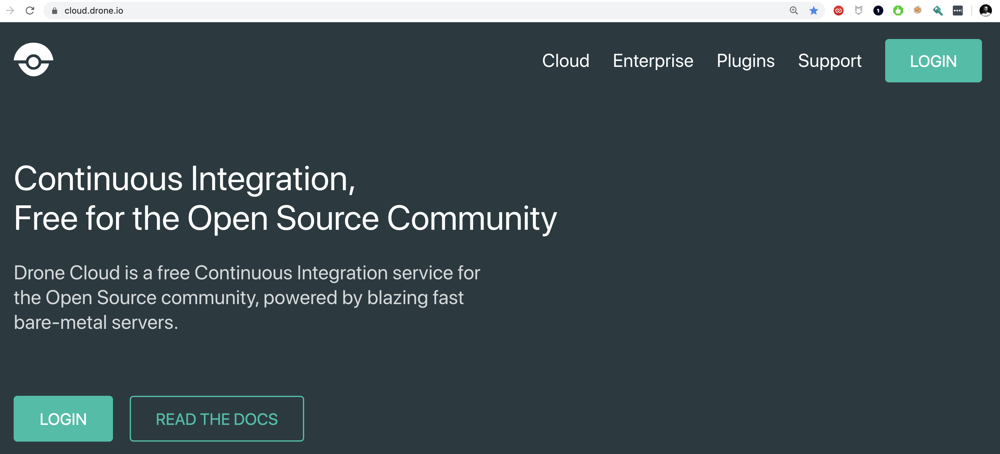
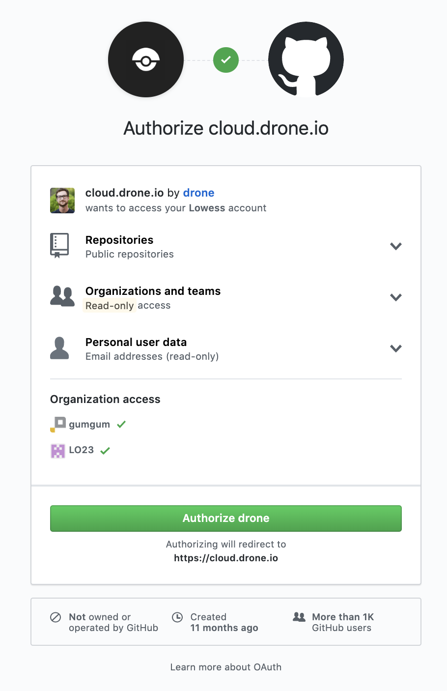

# DevOps 360° CI / CD

DevOps 360° CI / CD is an introduction to CI/CD with [Drone](http://drone.io/), [Ansible](https://www.ansible.com/) and [ReactJS](https://reactjs.org/). For more details about the project, please check: http://slides.com/floriandambrine/devops360

# 1. Stage 1 - Design a CI / CD / CDD Workflow

* Continuous Integration (CI):

#### :round_pushpin: ................. :twisted_rightwards_arrows: ................. :twisted_rightwards_arrows: ................. :twisted_rightwards_arrows: ................. :checkered_flag:

* Continuous Delivery (CD):

#### :round_pushpin: ................. :twisted_rightwards_arrows: ................. :twisted_rightwards_arrows: ................. :twisted_rightwards_arrows: ................. :twisted_rightwards_arrows: ................. :checkered_flag:

* Continuous Deployment (CDD):

#### :round_pushpin: ................. :twisted_rightwards_arrows: ................. :twisted_rightwards_arrows: ................. :twisted_rightwards_arrows: ................. :twisted_rightwards_arrows: ................. :twisted_rightwards_arrows: ................. :checkered_flag:

---

# 2. Stage 2 - Create the CI / CD pipeline for [DevOps-360-react app](https://github.com/Lowess/devops-360-react) with Drone


## 2.1. Login to [Drone Cloud](cloud.drone.io) and authenticate with Github

Visit [Drone Cloud](cloud.drone.io) and click on `Login`



* Authorize Drone cloud to access your public repositories



## 2.2. Integrate the Webapp repository with Drone

* On the Drone, activate the [DevOps-360-react app](https://github.com/Lowess/devops-360-react) repository so that Drone can track the git activity:


* Now click on  to go to the project and then make sure the **hooks** in the **settings** are set as follows:


* Create a `.drone.yml` file under the root of the [DevOps-360-react app](https://github.com/Lowess/devops-360-react) with the following content:

```yml
pipeline:
  echo:
    image: node:alpine
    commands:
      - echo 'Run CI / CD Pipeline on Drone'
```

* Commit and push the file and see what happens on Drone.

## 2.3. Write the CI steps for the pipeline

Use the following docs and write the corresponding pipeline steps to integrate your application:
* [DevOps-360-react app](https://github.com/Lowess/devops-360-react)
* [Drone Plugins](http://plugins.drone.io/)
* [Drone Slack Plugin](http://plugins.drone.io/drone-plugins/drone-slack/)

## 2.4. Write the CD steps for the pipeline

Use the following docs and write the corresponding pipeline steps to release your application:
* [Drone Plugins](http://plugins.drone.io/)
* [Drone Github Release Plugin](http://plugins.drone.io/drone-plugins/drone-github-release/)

## 2.5. Write the CDD steps for the pipeline

Use the following docs and write the corresponding pipeline steps to deploy your application:
* [Drone Plugins](http://plugins.drone.io/)
* [Drone Git Plugin](http://plugins.drone.io/drone-plugins/drone-git/)
* [Drone Ansible Plugin](https://hub.docker.com/r/lowess/drone-ansible/)

# 3. Stage 3 - Play and understand how CI / CD / CDD pipelines enhance a development process

Once you're done with the whole CI / CD / CDD, play with the Webapp and fake a real development process:
* Create a `feature` branch
* Iterate over the commits
* Merge into `master`
* Create a `tag` and push it to create a release
