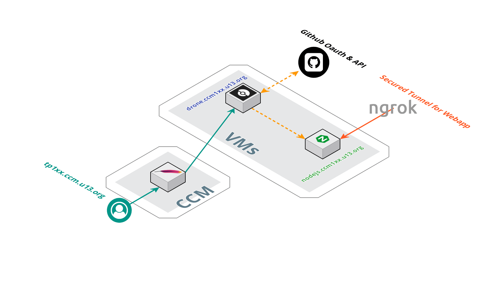
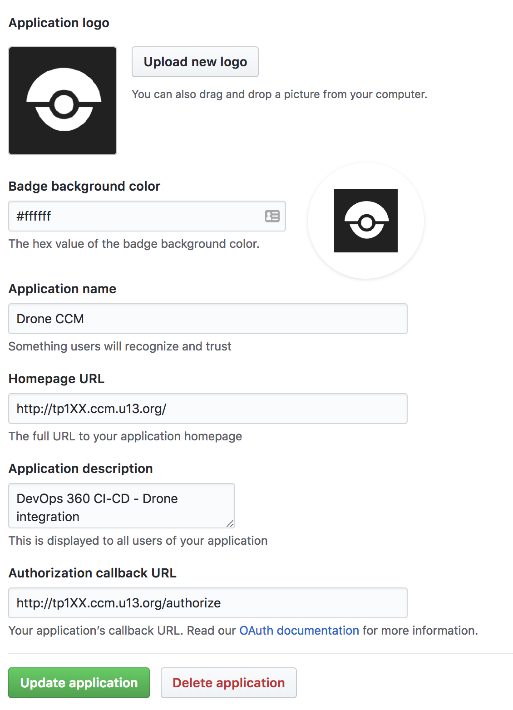
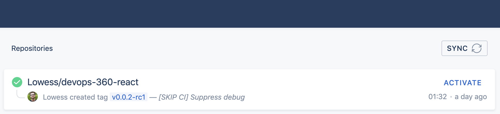
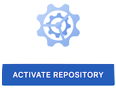
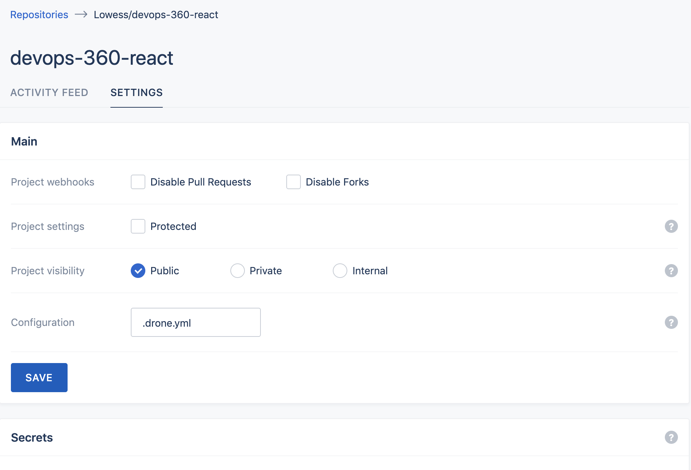

# DevOps 360° CI / CD

DevOps 360° CI / CD is an introduction to CI/CD with [Drone](http://drone.io/), [Ansible](https://www.ansible.com/) and [ReactJS](https://reactjs.org/). For more details about the project, please check: http://slides.com/floriandambrine/devops360

## 1. Stage 1 - Design a CI / CD / CDD Workflow

* Continuous Integration (CI):

#### :round_pushpin: ................. :twisted_rightwards_arrows: ................. :twisted_rightwards_arrows: ................. :twisted_rightwards_arrows: ................. :checkered_flag:

* Continuous Delivery (CD):

#### :round_pushpin: ................. :twisted_rightwards_arrows: ................. :twisted_rightwards_arrows: ................. :twisted_rightwards_arrows: ................. :twisted_rightwards_arrows: ................. :checkered_flag:

* Continuous Deployment (CDD):

#### :round_pushpin: ................. :twisted_rightwards_arrows: ................. :twisted_rightwards_arrows: ................. :twisted_rightwards_arrows: ................. :twisted_rightwards_arrows: ................. :twisted_rightwards_arrows: ................. :checkered_flag:

## 2. Stage 2 - Setup the CI / CD Server



### 2.1. GitHub OAuth App setup

* Follow the [Github documentation](https://developer.github.com/apps/building-oauth-apps/creating-an-oauth-app/) to setup an OAuth App

* You should endup with something like this: 

### 2.2. Ansible setup

#### 2.2.1. Drone

* Spin up the CI/CD stack using [Ansible](https://www.ansible.com/). Make sure your inventory file `ansible/inventories/vms/hosts` and your group_vars `ansible/inventories/vms/group_vars/all/libvirt/vars.yml` are configured properly.

* Run `ansible-galaxy install -r requirements.yml` in order to install role's dependencies from [Ansible Galaxy](https://galaxy.ansible.com/)

* Create a group_vars override in `ansible/inventories/vms/group_vars/drone/drone/vars.yml` to override multiple Drone settings:

> :point_up: Note that sensible data should be encrypted using `ansible-vault`. A good practice is to create a `ansible/inventories/vms/group_vars/drone/drone/vault.yml` file along side with your `vars.yml` files:

```yml
---
# vars.yml

drone_host: tp110.ccm.u13.org
drone_admins:
  - Lowess

# Secrets stored in vault.yml
drone_oauth_client: "{{ vault_drone_oauth_client }}"
drone_oauth_secret: "{{ vault_drone_oauth_secret }}"
```


```yml
---
# vault.yml

vault_drone_oauth_client: <GitHub OAuth Client>
vault_drone_oauth_secret: <GitHub OAuth Scret>
```

* Run the following ansible playbook to setup Drone (Note that if you used `ansible-vault` to encrypt secrets you will need to add `--vault-password-file <path-to-vault-file>` to your command):

```sh

cd ansible

# Setup the Drone CI CD server
ansible-playbook -i inventories/vms drone.yml
```

#### 2.2.2. Webserver SPA

* Fork the [DevOps-360-react app](https://github.com/Lowess/devops-360-react) project

* Create a group_vars override in `ansible/inventories/vms/group_vars/web/spa/vars.yml` to point the automation to your own [DevOps-360-react app](https://github.com/Lowess/devops-360-react) fork

```
# Setup the Webserver running the SPA
ansible-playbook -i inventories/vms spa.yml
```


## 3. Stage 3 - Create the CI / CD pipeline for [DevOps-360-react app](https://github.com/Lowess/devops-360-react) withg Drone

### 3.1. Integrate the Webapp repository with Drone

* On the Drone server, activate the [DevOps-360-react app](https://github.com/Lowess/devops-360-react) repository so that Drone can track the git activity:



* Now click on  to go to the project and then make sure the **hooks** in the **settings** are set as follows:



* Create a `.drone.yml` file under the root of the [DevOps-360-react app](https://github.com/Lowess/devops-360-react) with the following content:

```yml
pipeline:
  echo:
    image: node:alpine
    commands:
      - echo 'Run CI / CD Pipeline on Drone'
```

* Commit and push the file and see what happens on Drone.

### 3.2. Write the CI steps for the pipeline

Use the following docs and write the corresponding pipeline steps to integrate your application:
* [DevOps-360-react app](https://github.com/Lowess/devops-360-react)
* [Drone Plugins](http://plugins.drone.io/)
* [Drone Slack Plugin](http://plugins.drone.io/drone-plugins/drone-slack/)

### 3.2. Write the CD steps for the pipeline

Use the following docs and write the corresponding pipeline steps to release your application:
* [Drone Plugins](http://plugins.drone.io/)
* [Drone Github Release Plugin](http://plugins.drone.io/drone-plugins/drone-github-release/)

### 3.3. Write the CDD steps for the pipeline

Use the following docs and write the corresponding pipeline steps to deploy your application:
* [Drone Plugins](http://plugins.drone.io/)
* [Drone Git Plugin](http://plugins.drone.io/drone-plugins/drone-git/)
* [Drone Ansible Plugin](https://hub.docker.com/r/lowess/drone-ansible/)

## 4. Stage 4 - Play and understand how CI / CD / CDD pipelines enhance a development process

Once you're done with the whole CI / CD / CDD, play with the Webapp and fake a real development process:
* Create a `feature` branch
* Iterate over the commits
* Merge into `master`
* Create a `tag` and push it to create a release