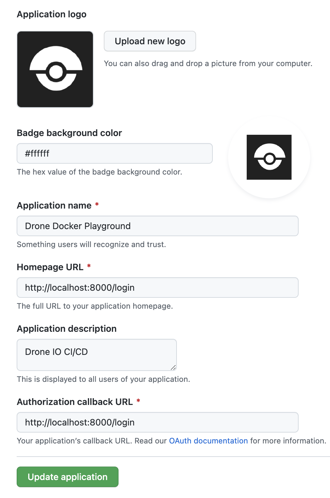

# :rocket: Drone CI Server on Docker

## Requirements

* Install [Docker](https://docs.docker.com/get-docker/) :whale:

---

## :lock: Create Github OAuth

* Setting up Github OAuth application

> The first step to do is to go to the Github and register [new OAuth application](https://github.com/settings/applications/new).

> If you want to try install drone on the local machine just use `http://localhost:8000/login` as `Authorization callback URL`.



Once registered, you should have:

* `Github client id`
* `Github client secret`

You will need them in the following step.

---

## :gear: Configure Drone CI

* Copy the file named `drone-example.env` into `drone.env`

```sh
cp drone-example.env drone.env
```

* Open the file with your favorite editor and configure it with your Github client ID and secret.

> :point_up: Environment variables from `drone.env` are in the .gitignore to keep your secrets outside of github repository.

---

## :rocket: Startup Drone CI


```sh
docker-compose up
```

* Visit the UI at [http://localhost:8000](http://localhost:8000)

> :point_up: You can skip the registration page by going to `http://localhost:8000/` once signed up on `http://localhost:8000/login`